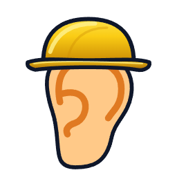
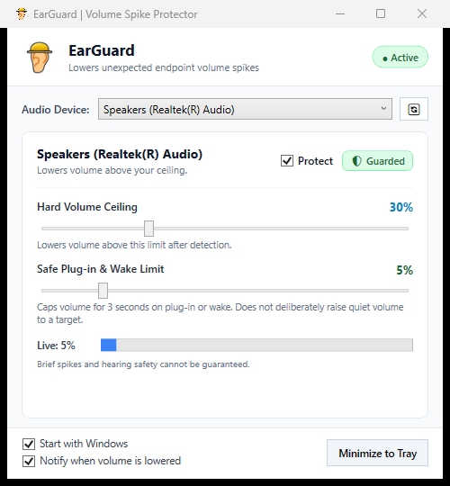

# 🛡️ EarGuard for Windows

> **Hardware Volume Spike Protector for IEM & Headphone Audiophiles**

<p align="center">
  
</p>

<p align="center">
  <a href="https://github.com/AmrZriek/EarGuard/releases/latest"></a>
  <a href="https://github.com/AmrZriek/EarGuard/releases/latest/download/EarGuard.exe"></a>
  
  
  
  
  
  <a href="https://ko-fi.com/amrzriek"></a>
</p>

<p align="center">
  <a href="https://github.com/AmrZriek/EarGuard/releases/latest/download/EarGuard.exe">
    
  </a>
</p>

---

## 🎧 The Problem: The Shotgun in Your Ear Canal

Fellas with IEMs and dongle DACs, I have a gift for you. 

I’m sure you value your hearing, so I built **EarGuard**. Because it only takes **one** accidental 100% volume blast with low-impedance, ultra-sensitive IEMs to realize you have a literal 12-gauge shotgun pointed directly inside your ear canal.

If you own a dongle without a physical gain knob, you already know the terror:

1. You plug in your dongle or wake your PC from sleep.
2. Windows Audio Service (`AudioSrv`) suffers amnesia, forgets your previous volume, and cheerfully initializes the endpoint at **1.0 (100% master volume)**.
3. Tidal in Exclusive Mode grabs hardware exclusive access and demands full digital line-level output.
4. Playback may start far louder than you intended, risking hearing damage.

**EarGuard detects and lowers endpoint volume above your chosen limit.** It runs in the tray and uses Windows CoreAudio callbacks with a watchdog behind them. Enforcement is reactive: a brief spike can get through before it responds, and some devices or drivers blunt it entirely. It is not a hearing-safety guarantee, and percentages are not sound-pressure measurements. Keep your listening level low anyway.

---

## 📸 The Interface

No bloated Electron. No web views. No 300 MB installer. Just a compact, native Windows interface:

<p align="center">
  
</p>

---

## Features

**It only ever lowers.** One routine writes endpoint volume. It reads the current scalar and asks for a smaller value only when what it read sits above your limit, so raising a ceiling or re-enabling protection on a quiet device writes nothing. EarGuard serializes its own read-compare-write transactions. Windows has no atomic read-and-set, so another app or your own hand on the volume key can still slip a change in between; if something lowers the volume mid-transaction, EarGuard's pending request can land above the newer value. That's a real gap, not a theoretical one.

**Your DAC shows up as your DAC.** Windows hands out form-factor names, which is how you end up with three entries called "Speakers". EarGuard reads `PKEY_Device_FriendlyName` and falls back to `PKEY_DeviceDesc`, so you see `Speakers (Realtek(R) Audio)`, `Speakers (fifine Microphone)`, `Headphones (Apple USB-C Adapter)` and can tell them apart.

**Plug-ins and wake-ups start quiet.** A new endpoint, or a resume from sleep, holds a three-second limit (`SafePlugInVol`, 5% by default). Windows restores an endpoint's previous volume a few hundred milliseconds *after* it appears, which is why a single clamp at detection time isn't enough: callbacks and the watchdog keep pulling the level back down through that window. Late restores included. When the three seconds are up the normal ceiling takes over, and a restored value below the ceiling is left alone. Nothing here blocks playback while EarGuard reacts.

**The window opens on whatever you're actually listening to.** It follows the Windows default endpoint until you pick a device yourself — including deliberately re-picking the one already selected. After that your choice sticks for the session, as long as the device is still around.

**Per-device, no global off switch.** The `Protect` checkbox is per endpoint. Unchecking it doesn't touch the volume; EarGuard just stops limiting that device. Enabled devices stay monitored the whole time EarGuard runs.

**Endpoint-level, not app-level.** It drives `IAudioEndpointVolume`, below the player's own volume control, which is why it still bites in WASAPI exclusive mode when the device and driver expose hardware volume. Not every driver does.

**Alerts you can't hear.** When EarGuard lowers something, an optional tray notification names the device and both levels. The balloon is drawn with `NIIF_NOSOUND`, so the "protection" notice never becomes the loudest thing in the room.

**80.5 KB, and it stays that way.** A single portable executable — 82,432 bytes as shipped, .NET Framework 4.8, no installer and no prerequisites. Protection runs off hardware COM callbacks with a 100 ms watchdog behind them, so idle CPU is noise-level. A device-change notification also costs a couple of scans rather than thirty; the engine rewrites its settings file and rebuilds its device list only when your hardware actually changed.

**Starts hidden.** With "Start with Windows" on, EarGuard launches into the tray with `--tray` and no window. Double-clicking the executable, or the tray icon, opens the interface.

---

## 🚀 Quick Start

1. Download [**EarGuard.exe**](https://github.com/AmrZriek/EarGuard/releases/latest/download/EarGuard.exe) from the [Releases](https://github.com/AmrZriek/EarGuard/releases/latest) page.
2. Run `EarGuard.exe`. It opens the window and detects your audio outputs.
3. Select your headphone/DAC dongle from the dropdown, verify `[✓] Protect` is checked, and set your **Hard Volume Ceiling** (e.g. `30%`) and **Safe Plug-in Limit** (e.g. `5%`).
4. Check **"Start with Windows"** and minimize to tray. Keep your listening volume low; EarGuard is an extra precaution, not a hearing-safety guarantee.

---

## 🛠️ Compiling from Source

Two ways, neither of which needs an installer, Node, or a package manager. The quick one uses the C# compiler already on every Windows box:

```cmd
csc @EarGuard.rsp
```

About half a second on a Ryzen 7 6800HS. The in-box compiler produces an 84,992-byte `EarGuard.exe`; Roslyn produces the smaller 82,432 bytes shipped in releases. Either way it lands in the repository root.

If you edit the `.rsp`, keep backslashes in the `src\*\*.cs` globs. Forward slashes there lose the directory part, and the compiler reports every source file as missing — which reads like a broken checkout rather than a bad path.

For the full pipeline — test suite first, then the app, then a SHA-256 of the result:

```powershell
powershell -ExecutionPolicy Bypass -File build.ps1
```

Under Roslyn (Visual Studio Build Tools) that script builds deterministically: same sources, same bytes, so you can check a download against the hash in the release notes. It passes `/deterministic+` only when Roslyn is present, because the in-box framework compiler predates the switch and rejects it outright. `-NoTest` skips the suite; `-Debug` keeps symbols.

---

## 📋 Release Notes

### v1.1.1

Fixes for protection quietly dropping out on reconnect and wake.

- The plug-in limit now holds for three seconds after a device appears, instead of being applied once at detection. Windows restores an endpoint's previous volume a few hundred milliseconds *after* it shows up, which was overwriting the clamp; if the restored value sat below the ceiling, nothing caught it either.
- Resume from sleep renews that window, and a disconnect/reconnect between scans no longer slips past it.
- All endpoint writes go through one locked routine. Overlapping adjustments can no longer undo a quieter setting.
- A device change no longer triggers ~30 rescans, ~30 settings-file writes, and ~30 UI device-list rebuilds. It now costs a couple of scans and publishes only on a real change.
- Non-finite values in `settings.json` can't poison the ceiling any more, and null device entries are dropped on load.
- `%APPDATA%\EarGuard\settings.json` round-trips device names containing backslashes, quotes, and commas.
- Fixed: `csc @EarGuard.rsp` failed with 17 "source file could not be opened" errors, because forward slashes in the `.rsp` globs lose the directory part.
- Fixed: the C# 5 compiler in the .NET Framework could not build the new result struct (CS0843), which broke the documented no-build-tools path.
- `build.ps1` now produces byte-identical binaries under Roslyn. Release assets carry their SHA-256.
- Removed the volume-raising "Test Clamp" button. Any control that writes a *louder* value to hardware doesn't belong in a hearing-protection tool; the screenshot in this README was also stale and showed it.

### v1.1.0

See the [v1.1.0 release](https://github.com/AmrZriek/EarGuard/releases/tag/v1.1.0) for deterministic logon startup, the MMCSS pro-audio worker, and self-healing recovery.

---

## 🎵 Tips for Audiophile Players (Tidal, Foobar2000, Qobuz)

* **Tidal:** If you use WASAPI Exclusive Mode, turn off **"Force Volume"** in the DAC's output settings so the player does not keep requesting full volume. Check behavior with your device; EarGuard cannot control every driver or exclusive-mode path.
* **Foobar2000:** WASAPI exclusive output needs hardware endpoint volume support for EarGuard's changes to affect playback. Shared-mode output uses Windows' endpoint volume control.

---

## ☕ Support

If EarGuard helped you catch an unexpected volume change, consider buying me a coffee!

[](https://ko-fi.com/amrzriek)

👉 **[https://ko-fi.com/amrzriek](https://ko-fi.com/amrzriek)**

---

## 📜 License

MIT License. Free and open source for the audio community. Share it with anyone who owns sensitive IEMs and values their hearing.
